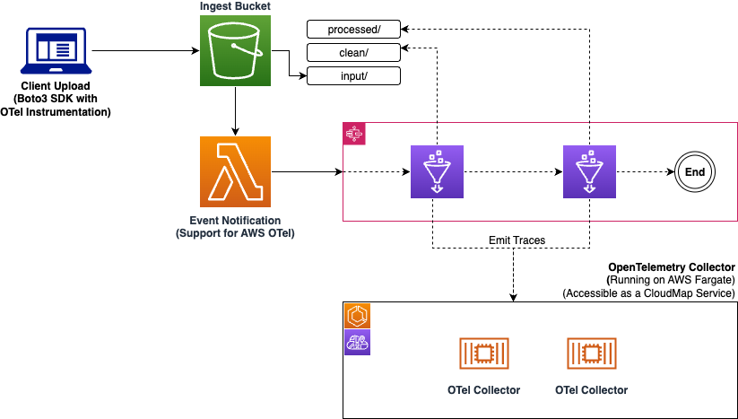

# OpenTelemetry Data Processing Solution

## Overview

This project demonstrates an AWS-based data processing pipeline using OpenTelemetry for observability. It processes Airbnb dataset, showcasing how to implement distributed tracing and metrics collection in a serverless architecture.



## Architecture

The solution uses the following AWS services:

- Amazon S3: Stores raw and processed data
- AWS Glue: Runs ETL jobs for data cleaning and processing
- AWS Step Functions: Orchestrates the data processing workflow
- AWS Lambda: Triggers the Step Function on S3 object creation
- Amazon ECS (Fargate): Hosts the OpenTelemetry Collector
- AWS CDK: Defines and deploys the infrastructure as code

## Prerequisites

- AWS Account
- AWS CLI configured with appropriate permissions
- Node.js and npm installed
- Python 3.x installed
- AWS CDK CLI installed (`npm install -g aws-cdk`)

## Setup

1. Clone the repository:

```
git clone https://github.com/your-repo/otel-data-processing-solution.git
cd otel-data-processing-solution
```
2. Create and activate a virtual environment:

For Linux and macOS:

```
python3 -m venv .venv
source .venv/bin/activate
```

For Windows:
```
python -m venv .venv
.venv\Scripts\activate
```

3. Install dependencies:

```
pip install -r requirements.txt
```

4. Bootstrap the CDK environment (if not already done):

```
cdk bootstrap
```

5. Deploy the stack:

```
cdk deploy
```

## Usage

1. Upload a raw Airbnb dataset file to the created S3 bucket in the `input/` prefix.
2. The Lambda function will automatically trigger the Step Function workflow.
3. The workflow will clean the data, process it, and store the results back in S3.

## Project Structure

- `app.py`: Main CDK app file
- `otel_solution_stack.py`: Defines the main stack for the solution
- `agent_service.py`: Defines the OpenTelemetry Collector ECS service
- `data_pipeline.py`: Defines the data processing pipeline components
- `source/`: Contains Lambda and Glue job scripts
- `cleaning_glue_job/`: Glue job for data cleaning
- `processing_glue_job/`: Glue job for data processing
- `trigger_step_function/`: Lambda function to trigger Step Function
- `x_ray_helper/`: Helper script for X-Ray correlation

## Configuration

- Modify `config/otel-agent-config.yaml` to adjust OpenTelemetry Collector settings
- Update Glue job scripts in `source/` directory to change data processing logic

## Observability

- The solution uses OpenTelemetry for distributed tracing and metrics collection
- Traces and metrics are sent to the OpenTelemetry Collector running on ECS
- X-Ray is used for end-to-end tracing across AWS services

## Cleanup

To avoid incurring future charges, delete the resources:

```
cdk destroy
```
## License

This project is licensed under the Apache-2.0 License. See [LICENSE](LICENSE) for more information.
